# 🔥 Calories Prediction

A Machine Learning project for predicting calories burned during running activities based on personal characteristics and running-related features.

---

## 📌 Project Overview

The **Calories Prediction** project implements a complete Machine Learning workflow, starting from raw data and continuing through data exploration, cleaning, visualization, preprocessing, model training, evaluation, and prediction.

The project is designed to demonstrate a practical and structured Machine Learning workflow using Python and Scikit-learn.

---

## 🎯 Objectives

The main objectives of this project are:

* Explore and understand the dataset.
* Analyze data quality.
* Clean and prepare the dataset.
* Perform exploratory data analysis.
* Create meaningful visualizations.
* Analyze relationships between variables.
* Study correlations with the target variable.
* Prepare the dataset for Machine Learning.
* Train multiple regression models.
* Evaluate model performance.
* Select the best-performing model.
* Save the trained model and preprocessing pipeline.
* Build a reusable prediction workflow.

---

## 📊 Dataset

The dataset contains **200 observations** and **10 columns**.

### Features

| Feature             | Description                       |
| ------------------- | --------------------------------- |
| Gender              | Gender category                   |
| Age                 | Age of the person                 |
| Height(cm)          | Height in centimeters             |
| Weight(kg)          | Weight in kilograms               |
| BMI                 | Body Mass Index                   |
| Running Time(min)   | Running duration in minutes       |
| Running Speed(km/h) | Running speed                     |
| Distance(km)        | Running distance                  |
| Average Heart Rate  | Average heart rate during running |
| Calories Burned     | Target variable                   |

### Target

```text
Calories Burned
```

This project is formulated as a **regression problem** because the target variable is continuous.

---

# 🧹 Data Cleaning

The project includes a dedicated data cleaning module:

```text
src/data_cleaning.py
```

The cleaning pipeline includes:

* Column name standardization.
* Numerical data type conversion.
* Gender value cleaning.
* Missing value handling.
* Duplicate removal.
* Invalid value removal.
* Impossible value filtering.
* Index resetting.
* Cleaned dataset export.

The processed dataset is stored in:

```text
data/processed/dataset_clean.csv
```

### Dataset Quality

The initial dataset contains:

```text
Rows:              200
Columns:           10
Total Values:      2,000
Missing Values:    0
Duplicate Rows:    0
```

---

# 📈 Data Visualization

The visualization stage analyzes the dataset using different statistical and graphical techniques.

All generated figures are stored inside:

```text
reports/figures/
```

The main visualization notebook is:

```text
notebooks/01_3_data_visualization.ipynb
```

---

## 🔥 Calories Burned Distribution

The histogram shows the distribution of the target variable, **Calories Burned**.

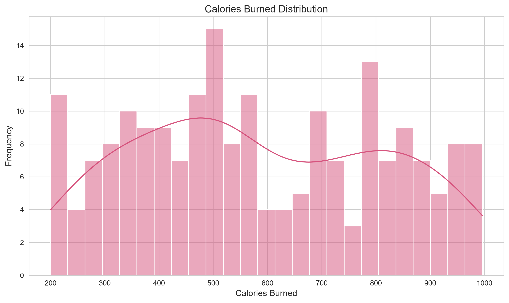

---

## 👥 Gender Distribution

The following visualization shows the distribution of observations across gender categories.

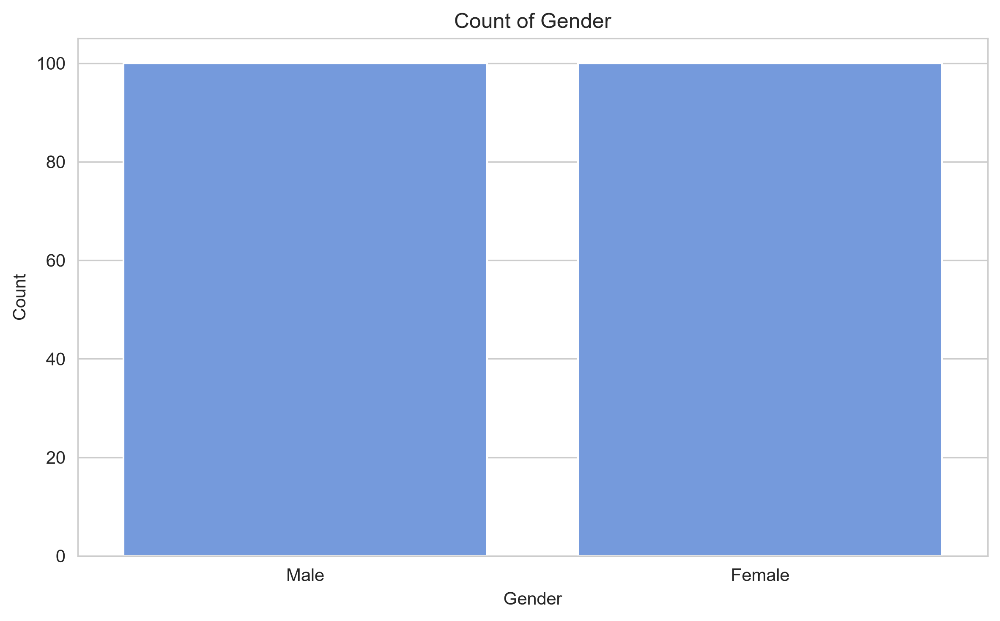

---

## 🔥 Calories Burned by Gender

This visualization compares the distribution of calories burned between gender categories.

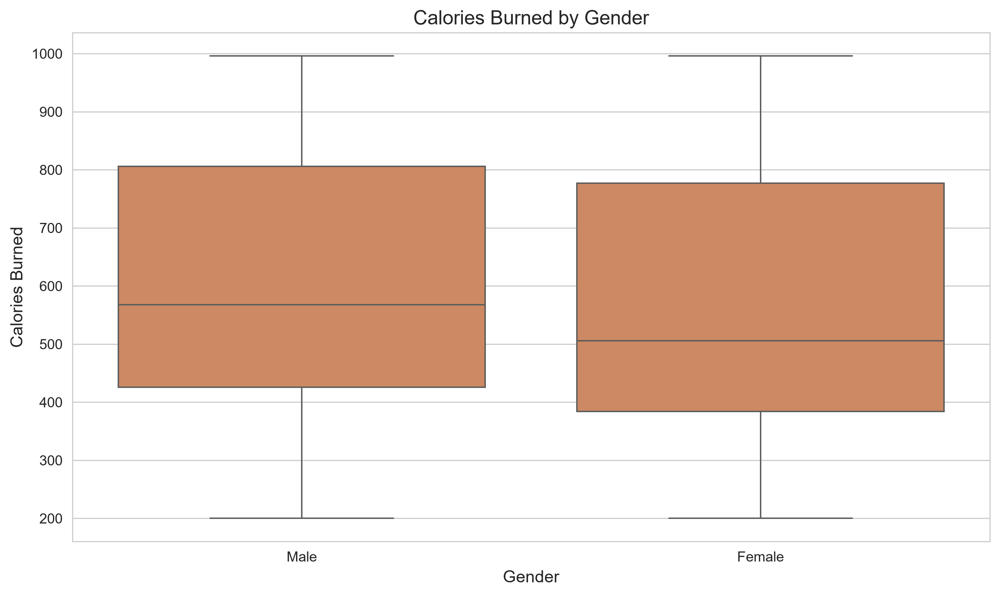

---

## 📊 Correlation Heatmap

The correlation heatmap provides an overview of relationships between numerical variables.

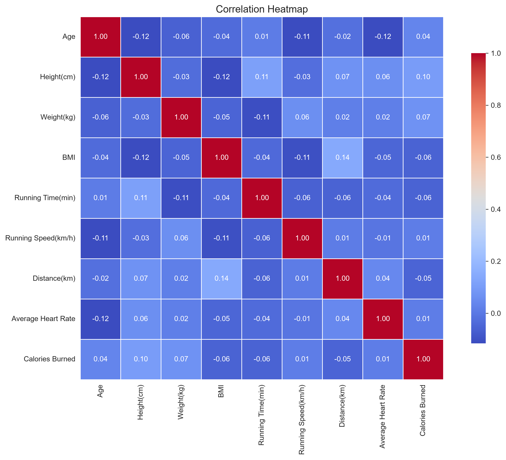

---

## 🎯 Target Correlations

This visualization shows the correlation between the numerical features and the target variable, **Calories Burned**.

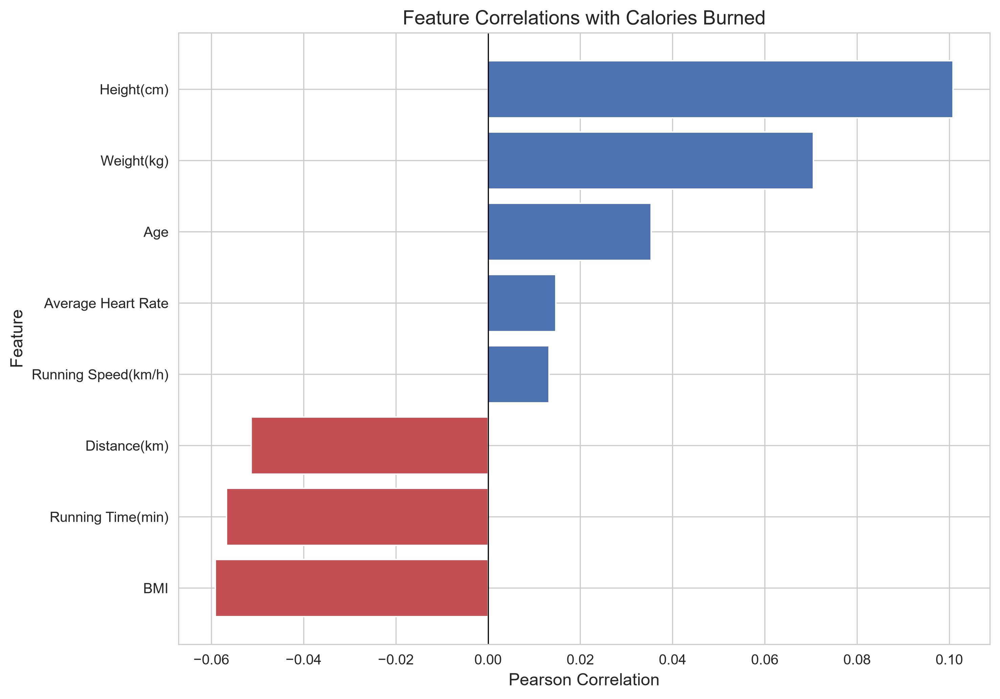

---

## 🏃 Calories vs Running Time

This scatter plot shows the relationship between running time and calories burned.

_vs_Calories_Burned.png)

---

## 📏 Calories vs Distance

This visualization shows the relationship between running distance and calories burned.

_vs_Calories_Burned.png)

---

## ❤️ Calories vs Average Heart Rate

This visualization shows the relationship between average heart rate and calories burned.

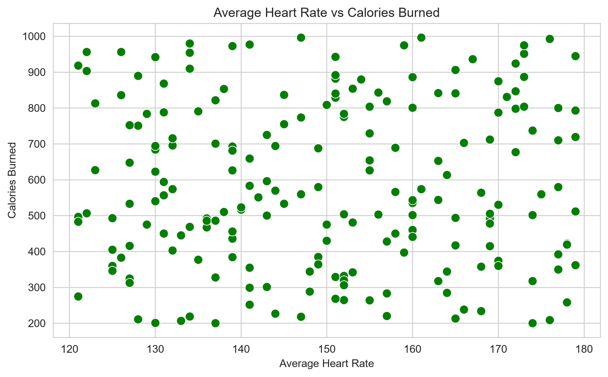

---

## ⚖️ Calories vs Weight

This scatter plot shows the relationship between body weight and calories burned.

_vs_Calories_Burned.png)

---

## 🎂 Calories vs Age

This visualization shows the relationship between age and calories burned.

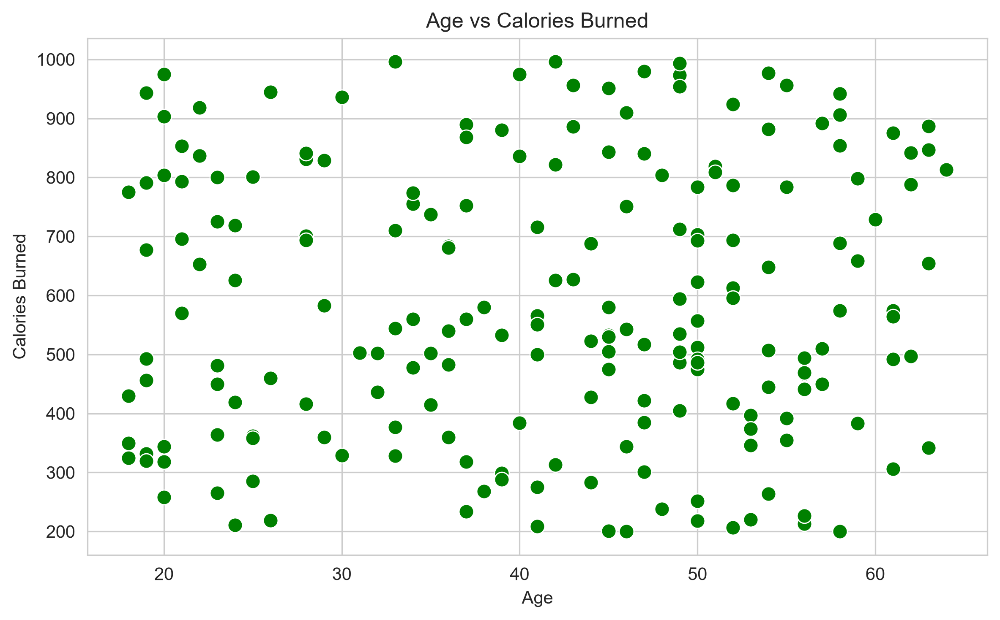

---

## 🏃 Running Time vs Distance

This visualization analyzes the relationship between running duration and distance.

_vs_Distance\(km\).png)

---

## ⚡ Running Speed vs Distance

This visualization analyzes the relationship between running speed and distance.

_vs_Distance\(km\).png)

---

## 📦 Numerical Feature Boxplots

Boxplots are used to understand the distribution and identify potential outliers in numerical variables.

Example:

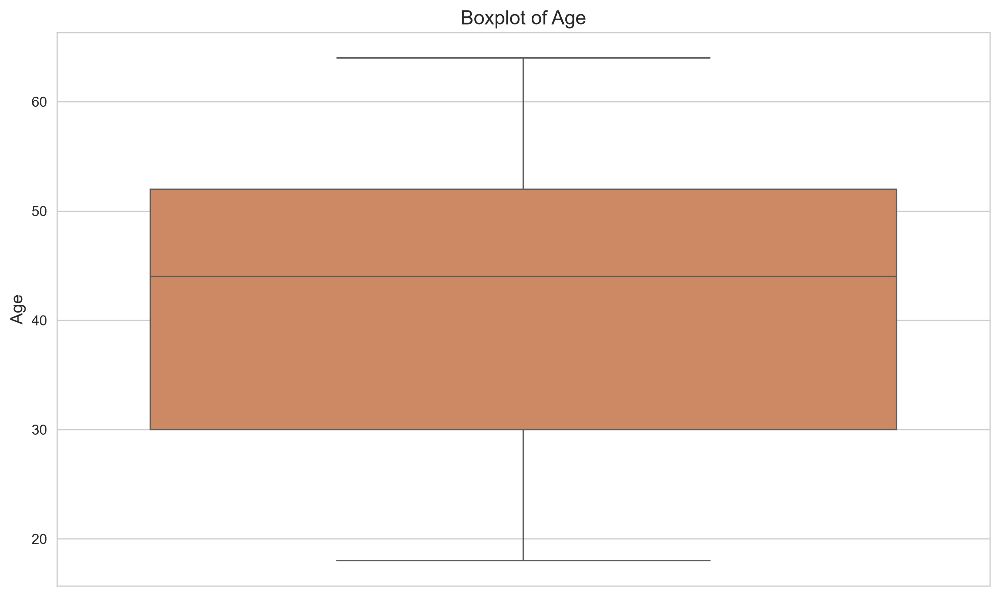

.png)

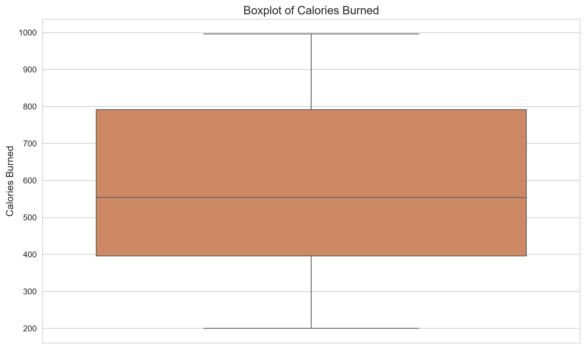

---

## 🎻 Calories Distribution by Gender

The violin plot provides a detailed view of the distribution of calories burned across gender categories.

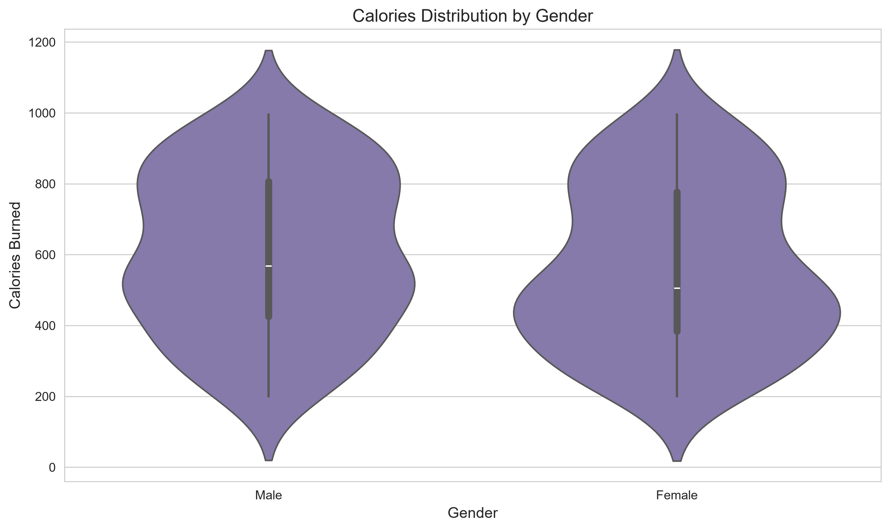

---

## 📈 Calories KDE Distribution

The KDE plot provides a smoothed representation of the probability density of calories burned.

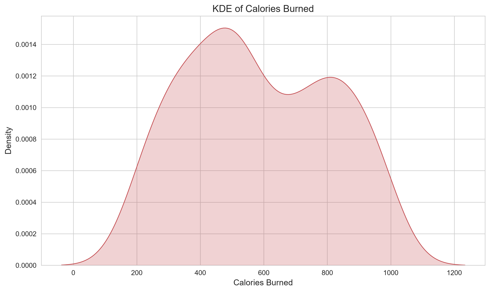

---

## 🔎 Pair Plot

The pair plot provides a general overview of relationships between numerical variables.

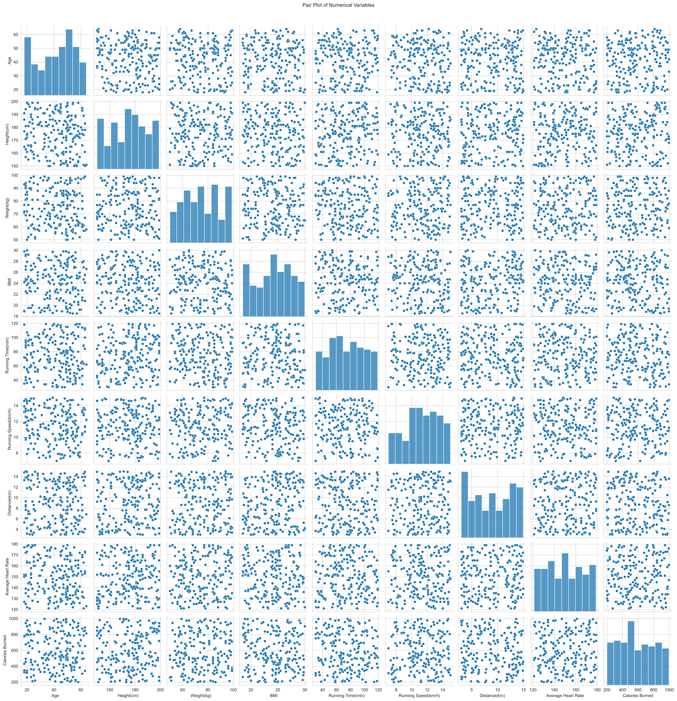

---

# 🤖 Machine Learning

The project is designed as a regression problem.

The planned models include:

* Linear Regression
* Decision Tree Regressor
* Random Forest Regressor
* Gradient Boosting Regressor

---

## ⚙️ Preprocessing

The preprocessing stage includes:

1. Separating features and target.
2. Identifying numerical features.
3. Identifying categorical features.
4. Encoding categorical variables.
5. Scaling numerical features when appropriate.
6. Splitting the data into training and testing sets.
7. Creating a reusable preprocessing pipeline.

The preprocessing pipeline will be saved as:

```text
models/preprocessor.pkl
```

---

# 📊 Model Evaluation

The Machine Learning models will be evaluated using:

### MAE

Mean Absolute Error measures the average absolute difference between actual and predicted values.

Lower values are better.

### MSE

Mean Squared Error measures the average squared prediction error.

Lower values are better.

### RMSE

Root Mean Squared Error is the square root of MSE.

Lower values are better.

### R²

R² measures the proportion of target variance explained by the model.

Higher values are generally better.

---

# 🧪 Testing

The project contains tests for the main modules:

```text
tests/
├── test_imports.py
├── test_data_loader.py
├── test_data_analysis.py
├── test_data_cleaning.py
└── test_visualization.py
```

Run the tests using:

```powershell
python tests\test_imports.py
python tests\test_data_loader.py
python tests\test_data_analysis.py
python tests\test_data_cleaning.py
python tests\test_visualization.py
```

---

# 📓 Notebooks

The project notebooks are organized as follows:

```text
notebooks/
├── 01_1_data_exploration.ipynb
├── 01_2_data_exploration.ipynb
├── 01_3_data_visualization.ipynb
├── 02_data_analysis.ipynb
└── 03_machine_learning.ipynb
```

Recommended execution order:

```text
01_1_data_exploration
        ↓
01_2_data_exploration
        ↓
01_3_data_visualization
        ↓
02_data_analysis
        ↓
03_machine_learning
```

---

# 📁 Project Structure

```text
calories-prediction/
│
├── data/
│   ├── raw/
│   │   └── dataset.csv
│   │
│   └── processed/
│       └── dataset_clean.csv
│
├── models/
│   ├── best_model.pkl
│   └── preprocessor.pkl
│
├── notebooks/
│   ├── 01_1_data_exploration.ipynb
│   ├── 01_2_data_exploration.ipynb
│   ├── 01_3_data_visualization.ipynb
│   ├── 02_data_analysis.ipynb
│   └── 03_machine_learning.ipynb
│
├── reports/
│   ├── figures/
│   ├── models/
│   ├── metrics/
│   ├── matrices/
│   ├── tables/
│   ├── test_cases/
│   └── notebooks/
│
├── scripts/
│
├── src/
│   ├── __init__.py
│   ├── imports.py
│   ├── data_loader.py
│   ├── data_cleaning.py
│   ├── data_analysis.py
│   ├── visualization.py
│   ├── preprocessing.py
│   ├── train_model.py
│   ├── evaluate_model.py
│   └── prediction.py
│
├── tests/
│   ├── test_imports.py
│   ├── test_data_loader.py
│   ├── test_data_analysis.py
│   ├── test_data_cleaning.py
│   └── test_visualization.py
│
├── .gitignore
├── README.md
├── PROJECT_DOCUMENTATION.md
├── CHANGELOG.md
├── CONTRIBUTING.md
├── CODE_OF_CONDUCT.md
├── SECURITY.md
└── LICENSE
```

---

# 🛠️ Technologies

* Python
* Pandas
* NumPy
* Matplotlib
* Seaborn
* Scikit-learn
* Joblib
* Jupyter Notebook

---

# 🚀 Installation

Create a virtual environment:

```bash
python -m venv venv
```

Activate it on Windows:

```powershell
venv\Scripts\activate
```

Install the required packages:

```bash
pip install -r requirements.txt
```

---

# ⚠️ Disclaimer

This project is intended for educational and Machine Learning demonstration purposes.

Calories burned are influenced by many physiological and activity-related factors. The predictions generated by the model should not be considered medical or physiological advice.

---

# 👨‍💻 Author

**Ayman Al-Jamal**

Computer Science Graduate
Junior Backend / Machine Learning Developer

---

# 📄 License

This project is distributed under the license included in the repository.
